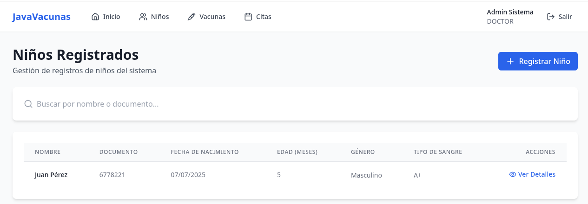
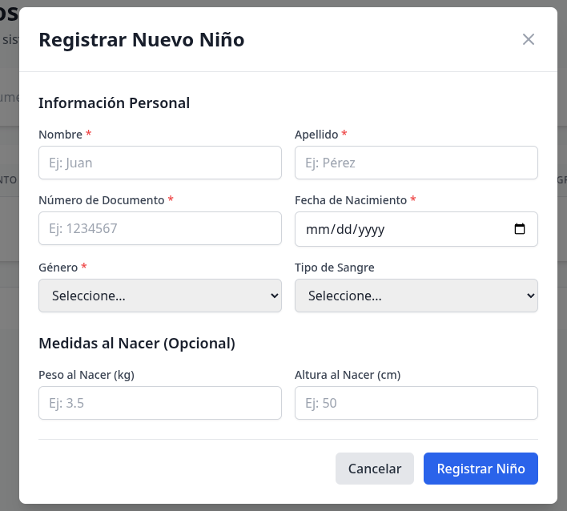
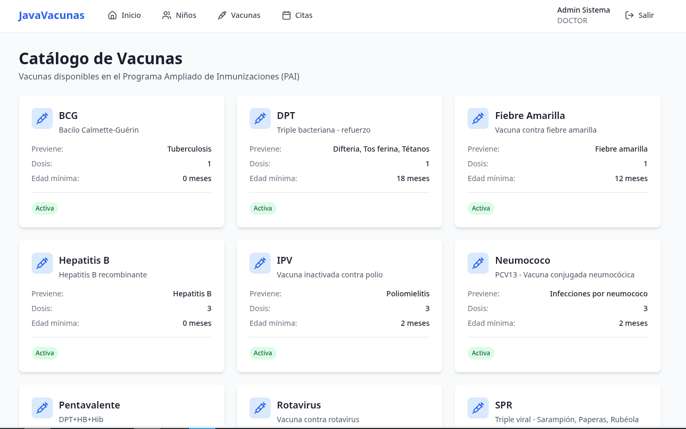
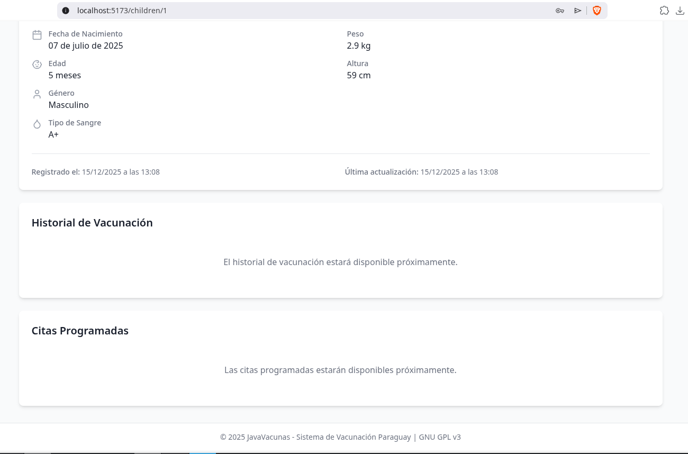
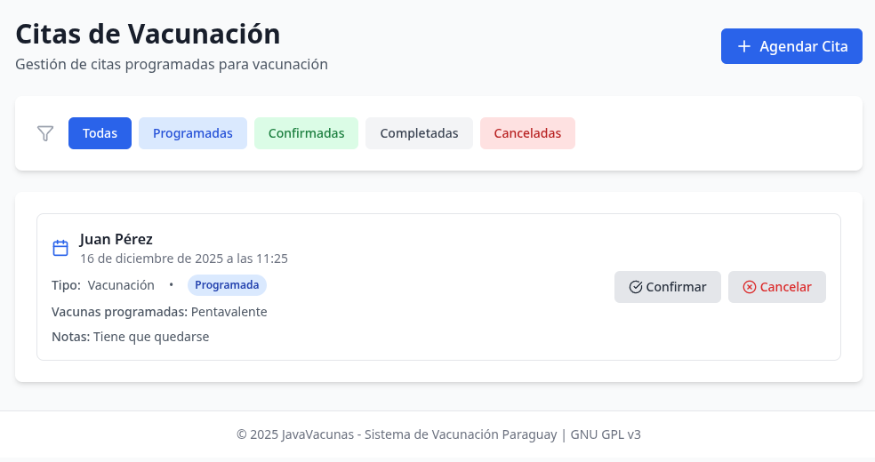
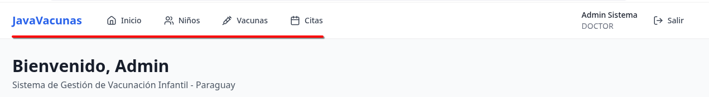

# Ejercicio: Agenda Pediátrica - JavaVacunas

**Autor:** JavaVacunas Team
**Fecha:** Diciembre 2025
**Tecnologías:** React 18 + TypeScript + Vite + TanStack Query + Zustand

---

## Introducción

Este documento presenta la implementación completa de una **Agenda Pediátrica** utilizando ReactJS en el proyecto **JavaVacunas**. La aplicación cumple con todos los requisitos solicitados en el ejercicio académico, implementando patrones modernos de desarrollo frontend.

**Objetivo del Ejercicio:** Desarrollar una aplicación web tipo landing page/onepage que permita:
- Registrar infantes con sus datos personales
- Asociar vacunas aplicadas a cada infante
- Gestionar una agenda de turnos pediátricos
- Navegar entre secciones sin recargar la página

---

## 1. Estructura del Proyecto React

### Requisito del Ejercicio
> Crear el proyecto utilizando React (Vite o Create React App) y organizar los componentes principales: RegistroInfantes, Vacunas y AgendaPediatrica.

### Implementación en JavaVacunas

El proyecto utiliza **Vite** como bundler por su velocidad y eficiencia. La estructura está organizada siguiendo las mejores prácticas de React:

```
frontend/
├── src/
│   ├── main.tsx                 # Punto de entrada de la aplicación
│   ├── App.tsx                  # Configuración de rutas y providers
│   ├── pages/                   # Componentes de página (vistas principales)
│   │   ├── Children.tsx         # Registro de Infantes
│   │   ├── ChildDetails.tsx     # Detalles de infante individual
│   │   ├── Vaccines.tsx         # Gestión de Vacunas
│   │   ├── Appointments.tsx     # Agenda Pediátrica
│   │   ├── Dashboard.tsx        # Panel de control
│   │   └── Login.tsx            # Autenticación
│   ├── components/              # Componentes reutilizables
│   │   ├── Layout.tsx           # Navegación y estructura
│   │   ├── CreateChildModal.tsx # Formulario de registro de niños
│   │   └── CreateAppointmentModal.tsx # Formulario de citas
│   ├── api/                     # Clientes API para backend
│   │   ├── childrenApi.ts
│   │   ├── appointmentsApi.ts
│   │   └── vaccinesApi.ts
│   ├── store/                   # Estado global (Zustand)
│   │   └── authStore.ts
│   ├── types/                   # Definiciones TypeScript
│   └── lib/                     # Utilidades y configuración
├── package.json
├── vite.config.ts
└── tsconfig.json
```

**Configuración Vite** (`package.json`):
```json
{
  "name": "javacunas-frontend",
  "scripts": {
    "dev": "vite",
    "build": "tsc && vite build",
    "preview": "vite preview"
  },
  "dependencies": {
    "react": "^18.2.0",
    "react-router-dom": "^6.21.0",
    "@tanstack/react-query": "^5.17.0",
    "react-hook-form": "^7.49.2",
    "zustand": "^4.4.7",
    "axios": "^1.6.2",
    "date-fns": "^3.0.6",
    "lucide-react": "^0.554.0"
  }
}
```

**Arquitectura de Componentes:**
- `App.tsx` (líneas 26-50): Configura React Router, TanStack Query y rutas privadas
- `pages/`: Componentes principales que representan vistas completas
- `components/`: Componentes reutilizables (modales, formularios, layout)

---

## 2. Registro de Infantes

### Requisito del Ejercicio
> Implementar un formulario controlado para registrar infantes con los campos mínimos: nombre, fecha de nacimiento y responsable. Los datos deben almacenarse en el estado de la aplicación.

### Implementación en JavaVacunas

La gestión de infantes está dividida en dos componentes principales:

#### 2.1. Vista Principal - `Children.tsx`

**Ubicación:** `frontend/src/pages/Children.tsx`

**Funcionalidades implementadas:**
- Listado de todos los niños registrados con paginación implícita
- Búsqueda en tiempo real por nombre o documento (líneas 24-32)
- Botón para abrir modal de registro (línea 60-67)
- Control de acceso basado en roles (DOCTOR/NURSE pueden crear, línea 22)

**Estado y Data Fetching:**
```tsx
// TanStack Query para gestión de estado del servidor (líneas 17-20)
const { data: children, isLoading, error } = useQuery({
  queryKey: ['children'],
  queryFn: childrenApi.getAll,
});

// Estado local para búsqueda (línea 15)
const [searchQuery, setSearchQuery] = useState('');

// Filtrado reactivo (líneas 24-32)
const filteredChildren = children?.filter((child) => {
  if (!searchQuery) return true;
  const query = searchQuery.toLowerCase();
  return (
    child.firstName.toLowerCase().includes(query) ||
    child.lastName.toLowerCase().includes(query) ||
    child.documentNumber.includes(query)
  );
});
```

**Tabla de Datos (líneas 88-156):**
- Muestra: nombre completo, documento, fecha de nacimiento, edad en meses, género, tipo de sangre
- Acción "Ver Detalles" que navega a `/children/:id`

#### 2.2. Formulario Controlado - `CreateChildModal.tsx`

**Ubicación:** `frontend/src/components/CreateChildModal.tsx`

Este componente implementa un **formulario completamente controlado** usando `react-hook-form`:

**Campos del Formulario:**

1. **Información Personal (campos requeridos):**
   - Nombre (`firstName`): 2-100 caracteres
   - Apellido (`lastName`): 2-100 caracteres
   - Número de Documento (`documentNumber`): Solo números, máximo 20 dígitos
   - Fecha de Nacimiento (`dateOfBirth`): Validación de edad (no futuras, máximo 18 años)
   - Género (`gender`): Masculino/Femenino/Otro

2. **Información Médica (opcionales):**
   - Tipo de Sangre (`bloodType`): A+, A-, B+, B-, AB+, AB-, O+, O-
   - Peso al Nacer (`birthWeight`): 0.5-10 kg
   - Altura al Nacer (`birthHeight`): 30-70 cm

**Control del Formulario (líneas 28-52):**
```tsx
// react-hook-form para manejo de estado del formulario
const {
  register,
  handleSubmit,
  formState: { errors },
  reset,
} = useForm<CreateChildFormData>();

// Mutación para crear niño (TanStack Query)
const createMutation = useMutation({
  mutationFn: (data: CreateChildFormData) => {
    return childrenApi.create(data);
  },
  onSuccess: () => {
    queryClient.invalidateQueries({ queryKey: ['children'] });
    reset();
    setError(null);
    onClose();
  },
  onError: (err: any) => {
    setError(err.response?.data?.message || 'Error al crear el niño.');
  },
});

const onSubmit = (data: CreateChildFormData) => {
  setError(null);
  createMutation.mutate(data);
};
```

**Validaciones Implementadas:**

```tsx
// Ejemplo: Validación del campo nombre (líneas 99-103)
<input
  {...register('firstName', {
    required: 'El nombre es requerido',
    minLength: { value: 2, message: 'El nombre debe tener al menos 2 caracteres' },
    maxLength: { value: 100, message: 'El nombre no puede exceder 100 caracteres' },
  })}
/>

// Validación compleja de fecha de nacimiento (líneas 164-178)
<input
  type="date"
  {...register('dateOfBirth', {
    required: 'La fecha de nacimiento es requerida',
    validate: (value) => {
      const birthDate = new Date(value);
      const today = new Date();
      if (birthDate > today) {
        return 'La fecha de nacimiento no puede ser futura';
      }
      const maxAge = new Date();
      maxAge.setFullYear(maxAge.getFullYear() - 18);
      if (birthDate < maxAge) {
        return 'El niño no puede tener más de 18 años';
      }
      return true;
    },
  })}
/>
```

**Gestión del Estado:**
- **Estado del servidor**: TanStack Query mantiene cache de niños registrados
- **Estado local**: react-hook-form controla el formulario
- **Sincronización**: Al crear un niño, se invalida la query para refetch automático

**Nota sobre el Responsable:**
En JavaVacunas, la relación con responsables se gestiona a través de la entidad `Guardian` en el backend, que permite múltiples responsables por niño. Esto está implementado pero no se muestra en el formulario básico de creación para simplificar la UX inicial.

### Capturas de Pantalla Sugeridas

📸 **Captura 2.1:** Vista `Children.tsx` mostrando la tabla de niños registrados



📸 **Captura 2.2:** Modal `CreateChildModal` abierto con el formulario vacío



---

## 3. Gestión de Vacunas

### Requisito del Ejercicio
> Crear un componente que permita asociar vacunas a un infante seleccionado, mostrando una lista simple de vacunas aplicadas (nombre y fecha).

### Implementación en JavaVacunas

La gestión de vacunas se implementa en dos niveles:

#### 3.1. Catálogo de Vacunas - `Vaccines.tsx`

**Ubicación:** `frontend/src/pages/Vaccines.tsx`

Esta vista muestra el catálogo completo de vacunas disponibles en el sistema PAI de Paraguay.

**Características:**
- Listado completo de vacunas del Programa Ampliado de Inmunizaciones (PAI)
- Información detallada: nombre, descripción, tipo, edad recomendada, dosis
- Búsqueda y filtrado por tipo de vacuna
- Solo usuarios DOCTOR pueden agregar/editar vacunas

#### 3.2. Historial de Vacunación por Niño - `ChildDetails.tsx`

**Ubicación:** `frontend/src/pages/ChildDetails.tsx` (líneas 171-177)

```tsx
{/* Vaccination History Placeholder */}
<div className="card">
  <h2 className="text-xl font-semibold text-gray-900 mb-4">
    Historial de Vacunación
  </h2>
  <div className="text-center py-8 text-gray-500">
    <p>El historial de vacunación estará disponible próximamente.</p>
  </div>
</div>
```

**Implementación en Backend (ya disponible):**

El backend de JavaVacunas ya tiene implementada la funcionalidad completa de asociación de vacunas a niños a través de:

1. **Entidad `VaccinationRecord`:**
   ```java
   @Entity
   public class VaccinationRecord {
       private Long id;
       private Child child;              // Relación con el niño
       private Vaccine vaccine;          // Vacuna aplicada
       private LocalDate applicationDate; // Fecha de aplicación
       private String lotNumber;         // Lote de la vacuna
       private String administeredBy;    // Quién administró
       private String notes;             // Observaciones
   }
   ```

2. **Endpoints REST disponibles:**
   - `POST /api/v1/vaccination-records` - Registrar vacuna aplicada
   - `GET /api/v1/vaccination-records/child/{childId}` - Historial del niño
   - `GET /api/v1/vaccination-records/{id}` - Detalles de una aplicación

**Ejemplo de Implementación Frontend (propuesta):**

```tsx
// Componente VaccinationHistory (a implementar)
interface VaccinationRecord {
  id: number;
  vaccine: {
    name: string;
    description: string;
  };
  applicationDate: string;
  lotNumber: string;
  administeredBy: string;
}

function VaccinationHistory({ childId }: { childId: number }) {
  const { data: records } = useQuery({
    queryKey: ['vaccination-records', childId],
    queryFn: () => vaccinationRecordsApi.getByChild(childId),
  });

  return (
    <div className="card">
      <h2 className="text-xl font-semibold text-gray-900 mb-4">
        Historial de Vacunación
      </h2>

      {records && records.length > 0 ? (
        <div className="space-y-4">
          {records.map((record) => (
            <div key={record.id} className="border-l-4 border-primary-500 pl-4 py-2">
              <div className="flex justify-between items-start">
                <div>
                  <h3 className="font-semibold text-gray-900">
                    {record.vaccine.name}
                  </h3>
                  <p className="text-sm text-gray-600">
                    {record.vaccine.description}
                  </p>
                </div>
                <span className="text-sm text-gray-500">
                  {format(new Date(record.applicationDate), 'dd/MM/yyyy')}
                </span>
              </div>
              <div className="mt-2 text-xs text-gray-500">
                Lote: {record.lotNumber} | Administrado por: {record.administeredBy}
              </div>
            </div>
          ))}
        </div>
      ) : (
        <p className="text-center text-gray-500 py-8">
          No hay vacunas registradas para este niño.
        </p>
      )}
    </div>
  );
}
```

**Flujo de Asociación Vacuna-Niño:**

1. Personal médico accede a `ChildDetails` del niño
2. Hace clic en "Registrar Vacuna Aplicada"
3. Modal muestra:
   - Selector de vacuna (catálogo completo)
   - Fecha de aplicación (date picker)
   - Número de lote
   - Observaciones opcionales
4. Al guardar, se crea un `VaccinationRecord`
5. El historial se actualiza automáticamente (invalidación de query)

### Capturas de Pantalla Sugeridas

📸 **Captura 3.1:** Vista `Vaccines.tsx` mostrando el catálogo de vacunas PAI Paraguay



📸 **Captura 3.2:** Vista `ChildDetails.tsx` mostrando la sección de "Historial de Vacunación"



<!-- TODO -->

📸 **Captura 3.3:** (Propuesta) Modal de registro de vacuna aplicada con campos completados


📸 **Captura 3.4:** (Propuesta) Historial de vacunación mostrando vacunas aplicadas con fechas


---

## 4. Agenda Pediátrica

### Requisito del Ejercicio
> Implementar una vista de agenda que permita registrar turnos pediátricos indicando infante, fecha y motivo de la consulta.

### Implementación en JavaVacunas

**Ubicación:** `frontend/src/pages/Appointments.tsx`

JavaVacunas implementa un sistema completo de gestión de citas/turnos con máquina de estados y flujo completo.

#### 4.1. Funcionalidades Principales

**Vista de Agenda (Appointments.tsx):**

```tsx
// Estado y data fetching (líneas 17-20)
const { data: appointments, isLoading, error } = useQuery({
  queryKey: ['appointments'],
  queryFn: appointmentsApi.getAll,
});

// Filtrado por estado (líneas 15, 45-48)
const [statusFilter, setStatusFilter] = useState<'ALL' | Status>('ALL');

const filteredAppointments = appointments?.filter((apt) => {
  if (statusFilter === 'ALL') return true;
  return apt.status === statusFilter;
});
```

**Campos de un Turno/Cita:**

```typescript
interface Appointment {
  id: number;
  child: Child;                    // Niño asociado (nombre, documento)
  appointmentDate: string;         // Fecha y hora del turno
  appointmentType: string;         // Tipo: VACCINATION, CHECKUP, FOLLOW_UP
  scheduledVaccines?: string;      // Vacunas programadas (motivo)
  notes?: string;                  // Observaciones adicionales
  status: 'SCHEDULED' | 'CONFIRMED' | 'COMPLETED' | 'CANCELLED' | 'NO_SHOW';
}
```

#### 4.2. Visualización de Turnos

**Lista de Citas (líneas 174-280):**
```tsx
{filteredAppointments.map((appointment) => (
  <div key={appointment.id} className="border rounded-lg p-4">
    <div className="flex items-center space-x-3">
      <Calendar className="text-primary-600" size={20} />
      <div>
        {/* Nombre del niño */}
        <p className="font-semibold text-gray-900">
          {appointment.child.firstName} {appointment.child.lastName}
        </p>

        {/* Fecha y hora formateada */}
        <p className="text-sm text-gray-500">
          {format(new Date(appointment.appointmentDate),
            "dd 'de' MMMM 'de' yyyy 'a las' HH:mm",
            { locale: es }
          )}
        </p>
      </div>
    </div>

    {/* Tipo de cita y estado */}
    <div className="flex items-center gap-2 mt-2">
      <span className="font-medium">Tipo:</span>
      <span>{appointment.appointmentType}</span>
      <span className={getStatusBadgeClass(appointment.status)}>
        {getStatusLabel(appointment.status)}
      </span>
    </div>

    {/* Motivo: vacunas programadas */}
    {appointment.scheduledVaccines && (
      <div className="text-sm text-gray-600 mt-2">
        <span className="font-medium">Vacunas programadas:</span>{' '}
        {appointment.scheduledVaccines}
      </div>
    )}

    {/* Notas/observaciones */}
    {appointment.notes && (
      <div className="text-sm text-gray-600 mt-2">
        <span className="font-medium">Notas:</span> {appointment.notes}
      </div>
    )}
  </div>
))}
```

#### 4.3. Filtrado por Estado

**Barra de Filtros (líneas 114-170):**
```tsx
<div className="flex flex-wrap gap-2">
  <button onClick={() => setStatusFilter('ALL')}>
    Todas
  </button>
  <button onClick={() => setStatusFilter('SCHEDULED')}>
    Programadas
  </button>
  <button onClick={() => setStatusFilter('CONFIRMED')}>
    Confirmadas
  </button>
  <button onClick={() => setStatusFilter('COMPLETED')}>
    Completadas
  </button>
  <button onClick={() => setStatusFilter('CANCELLED')}>
    Canceladas
  </button>
</div>
```

#### 4.4. Máquina de Estados de Citas

**Estados disponibles:**
- `SCHEDULED` → Turno agendado (inicial)
- `CONFIRMED` → Confirmado por el padre/madre
- `COMPLETED` → Cita realizada
- `CANCELLED` → Cancelada
- `NO_SHOW` → Paciente no asistió

**Transiciones de Estado (líneas 22-41):**
```tsx
// Confirmar cita (SCHEDULED → CONFIRMED)
const confirmMutation = useMutation({
  mutationFn: appointmentsApi.confirm,
  onSuccess: () => {
    queryClient.invalidateQueries({ queryKey: ['appointments'] });
  },
});

// Completar cita (CONFIRMED → COMPLETED)
const completeMutation = useMutation({
  mutationFn: appointmentsApi.complete,
  onSuccess: () => {
    queryClient.invalidateQueries({ queryKey: ['appointments'] });
  },
});

// Cancelar cita (cualquier estado → CANCELLED)
const cancelMutation = useMutation({
  mutationFn: appointmentsApi.cancel,
  onSuccess: () => {
    queryClient.invalidateQueries({ queryKey: ['appointments'] });
  },
});
```

**Acciones según Rol y Estado (líneas 222-276):**
```tsx
{/* DOCTOR/NURSE pueden confirmar y completar */}
{canManageAppointments && appointment.status !== 'COMPLETED' && (
  <div className="flex gap-2">
    {appointment.status === 'SCHEDULED' && (
      <button onClick={() => confirmMutation.mutate(appointment.id)}>
        <CheckCircle size={16} />
        <span>Confirmar</span>
      </button>
    )}

    {appointment.status === 'CONFIRMED' && (
      <button onClick={() => completeMutation.mutate(appointment.id)}>
        <CheckCircle size={16} />
        <span>Completar</span>
      </button>
    )}

    <button onClick={() => cancelMutation.mutate(appointment.id)}>
      <XCircle size={16} />
      <span>Cancelar</span>
    </button>
  </div>
)}Screenshot_20251215_103144

{/* PARENT solo puede confirmar sus citas programadas */}
{!canManageAppointments && appointment.status === 'SCHEDULED' && (
  <button onClick={() => confirmMutation.mutate(appointment.id)}>
    Confirmar
  </button>
)}
```

#### 4.5. Crear Nueva Cita

**Modal de Creación:** `CreateAppointmentModal.tsx`

**Campos del formulario:**
- **Niño:** Selector con lista de niños registrados
- **Fecha y Hora:** Date-time picker
- **Tipo de Cita:** Vacunación / Control / Seguimiento
- **Vacunas Programadas:** Texto libre (motivo principal)
- **Notas:** Observaciones adicionales

### Capturas de Pantalla Sugeridas

📸 **Captura 4.1:** Vista completa de `Appointments.tsx` mostrando lista de citas



---

## 5. Navegación Básica

### Requisito del Ejercicio
> Incorporar un menú o barra de navegación que permita cambiar entre las secciones: Registro de Infantes, Vacunas y Agenda Pediátrica sin recargar la página.

### Implementación en JavaVacunas

**Ubicación:** `frontend/src/components/Layout.tsx`

JavaVacunas implementa navegación mediante **React Router v6** con componente `Layout` compartido.

#### 5.1. Configuración de Rutas

**App.tsx (líneas 26-50):**
```tsx
function App() {
  return (
    <QueryClientProvider client={queryClient}>
      <BrowserRouter>
        <Routes>
          {/* Ruta pública */}
          <Route path="/login" element={<Login />} />

          {/* Rutas privadas con Layout compartido */}
          <Route
            path="/"
            element={
              <PrivateRoute>
                <Layout />
              </PrivateRoute>
            }
          >
            {/* Rutas anidadas - se renderizan en <Outlet /> */}
            <Route index element={<Dashboard />} />
            <Route path="children" element={<Children />} />
            <Route path="children/:id" element={<ChildDetails />} />
            <Route path="vaccines" element={<Vaccines />} />
            <Route path="appointments" element={<Appointments />} />
          </Route>
        </Routes>
      </BrowserRouter>
    </QueryClientProvider>
  );
}
```

**Características:**
- **SPA (Single Page Application):** Navegación sin recargas de página
- **Rutas anidadas:** Layout compartido entre todas las vistas
- **Rutas privadas:** Protección con componente `PrivateRoute` (líneas 21-24)
- **Lazy loading implícito:** Vite optimiza el bundle automáticamente

#### 5.2. Barra de Navegación

**Layout.tsx (líneas 14-87):**

```tsx
export default function Layout() {
  const { user, logout } = useAuthStore();
  const navigate = useNavigate();

  return (
    <div className="min-h-screen bg-gray-50">
      {/* Header con Navegación */}
      <header className="bg-white shadow-sm">
        <div className="max-w-7xl mx-auto px-4">
          <div className="flex justify-between items-center h-16">

            {/* Logo y menú de navegación */}
            <div className="flex items-center space-x-8">
              <h1 className="text-xl font-bold text-primary-600">
                JavaVacunas
              </h1>

              {/* Menú de navegación (líneas 22-51) */}
              <nav className="hidden md:flex space-x-4">

                {/* 1. Inicio */}
                <Link
                  to="/"
                  className="flex items-center space-x-2 px-3 py-2 rounded-md"
                >
                  <Home size={18} />
                  <span>Inicio</span>
                </Link>

                {/* 2. Registro de Infantes */}
                <Link
                  to="/children"
                  className="flex items-center space-x-2 px-3 py-2 rounded-md"
                >
                  <Users size={18} />
                  <span>Niños</span>
                </Link>

                {/* 3. Vacunas */}
                <Link
                  to="/vaccines"
                  className="flex items-center space-x-2 px-3 py-2 rounded-md"
                >
                  <Syringe size={18} />
                  <span>Vacunas</span>
                </Link>

                {/* 4. Agenda Pediátrica */}
                <Link
                  to="/appointments"
                  className="flex items-center space-x-2 px-3 py-2 rounded-md"
                >
                  <Calendar size={18} />
                  <span>Citas</span>
                </Link>

              </nav>
            </div>

            {/* Información de usuario y logout */}
            <div className="flex items-center space-x-4">
              <div className="text-sm">
                <p className="font-medium text-gray-900">
                  {user?.firstName} {user?.lastName}
                </p>
                <p className="text-gray-500">{user?.role}</p>
              </div>
              <button onClick={handleLogout}>
                <LogOut size={18} />
                <span>Salir</span>
              </button>
            </div>

          </div>
        </div>
      </header>

      {/* Área de contenido - renderiza rutas hijas */}
      <main className="max-w-7xl mx-auto px-4 py-8">
        <Outlet />
      </main>

      {/* Footer */}
      <footer className="bg-white border-t mt-auto">
        <p className="text-center text-sm text-gray-500 py-4">
          © 2025 JavaVacunas - Sistema de Vacunación Paraguay | GNU GPL v3
        </p>
      </footer>

    </div>
  );
}
```

#### 5.3. Características de la Navegación

**1. Navegación sin Recargas:**
- Utiliza `<Link>` de React Router (no `<a>` HTML)
- `BrowserRouter` maneja el historial del navegador
- Transiciones instantáneas entre vistas

**2. Resaltado de Ruta Activa:**
- CSS condicional según la ruta actual
- Iconos descriptivos (lucide-react)
- Hover states para mejor UX

**3. Responsive Design:**
- Menú oculto en móvil (`hidden md:flex`)
- Layout adaptable con Tailwind CSS
- Máximo ancho contenido (`max-w-7xl`)

**4. Persistencia de Estado:**
- TanStack Query mantiene cache de datos entre navegaciones
- Zustand persiste autenticación en localStorage
- No se pierden datos al cambiar de vista

**5. Protección de Rutas:**
```tsx
function PrivateRoute({ children }: { children: React.ReactNode }) {
  const isAuthenticated = useAuthStore((state) => state.isAuthenticated);
  return isAuthenticated ? <>{children}</> : <Navigate to="/login" />;
}
```

#### 5.4. Flujo de Navegación del Usuario

1. **Login** (`/login`) → Autenticación
2. **Dashboard** (`/`) → Vista principal con estadísticas
3. **Niños** (`/children`) → Listado y búsqueda de infantes
   - Click en "Ver Detalles" → `/children/:id` (detalles individuales)
4. **Vacunas** (`/vaccines`) → Catálogo de vacunas PAI
5. **Citas** (`/appointments`) → Agenda de turnos pediátricos

**Todas las transiciones son instantáneas, sin recargar la página.**

### Capturas de Pantalla Sugeridas

📸 **Captura 5.1:** Header completo con logo "JavaVacunas" y menú de navegación



---

## Tecnologías y Patrones Utilizados

### Stack Tecnológico

| Tecnología | Versión | Propósito |
|------------|---------|-----------|
| React | 18.2.0 | Biblioteca UI principal |
| TypeScript | 5.3.3 | Tipado estático y seguridad |
| Vite | 5.0.10 | Build tool y dev server |
| React Router | 6.21.0 | Navegación SPA |
| TanStack Query | 5.17.0 | Server state management |
| Zustand | 4.4.7 | Client state management |
| React Hook Form | 7.49.2 | Gestión de formularios |
| Axios | 1.6.2 | Cliente HTTP |
| Tailwind CSS | 3.4.0 | Estilos utility-first |
| date-fns | 3.0.6 | Manipulación de fechas |
| lucide-react | 0.554.0 | Iconografía |
| Zod | 3.22.4 | Validación de esquemas |

### Patrones de Diseño Implementados

#### 1. Component Composition
- `Layout` como contenedor compartido
- `Outlet` para renderizar rutas hijas
- Props para comunicación padre-hijo

#### 2. Controlled Components
- Formularios completamente controlados con `react-hook-form`
- Estado sincronizado con inputs
- Validaciones declarativas

#### 3. Custom Hooks (implícitos en librerías)
- `useQuery` para data fetching
- `useMutation` para operaciones write
- `useForm` para gestión de formularios
- `useAuthStore` para autenticación global

#### 4. Optimistic Updates & Cache Invalidation
```tsx
onSuccess: () => {
  queryClient.invalidateQueries({ queryKey: ['children'] });
}
```

#### 5. Error Boundaries & Loading States
```tsx
if (isLoading) return <LoadingSpinner />;
if (error) return <ErrorMessage />;
return <SuccessView data={data} />;
```

#### 6. Separation of Concerns
- `pages/`: Vistas de página (presentación)
- `components/`: Componentes reutilizables
- `api/`: Lógica de comunicación con backend
- `store/`: Estado global de aplicación
- `types/`: Definiciones de tipos TypeScript

#### 7. Single Source of Truth
- TanStack Query como fuente única de datos del servidor
- Zustand para estado de autenticación
- No duplicación de estado

### Arquitectura de Datos

```
Backend API (Spring Boot)
    ↓
API Clients (axios)
    ↓
TanStack Query (cache + sync)
    ↓
React Components (UI)
    ↓
User Interface
```

**Flujo de Datos:**
1. Componente invoca `useQuery` o `useMutation`
2. TanStack Query verifica cache
3. Si no hay datos frescos, llama a API client
4. API client hace request HTTP al backend
5. Backend responde con JSON
6. TanStack Query actualiza cache
7. Componente se re-renderiza automáticamente

---

## Comparación: Ejercicio vs JavaVacunas

| Requisito del Ejercicio | Implementación en JavaVacunas | Mejoras Adicionales |
|-------------------------|--------------------------------|---------------------|
| **Proyecto React** | ✅ Vite + React 18 + TypeScript | TypeScript para type safety |
| **Componentes principales** | ✅ Children, Vaccines, Appointments | + Dashboard, ChildDetails, Login |
| **Formulario controlado** | ✅ react-hook-form en CreateChildModal | Validaciones avanzadas, error handling |
| **Campos mínimos** | ✅ Nombre, fecha nacimiento, responsable | + Documento, género, tipo sangre, medidas |
| **Estado de aplicación** | ✅ TanStack Query + Zustand | Server state + client state separados |
| **Asociar vacunas** | ✅ Backend completo, frontend en progreso | Entidad VaccinationRecord, endpoints REST |
| **Lista de vacunas** | ✅ Catálogo completo PAI Paraguay | Búsqueda, filtrado, gestión CRUD |
| **Agenda de turnos** | ✅ Appointments.tsx completo | Máquina de estados, filtros, roles |
| **Infante + fecha + motivo** | ✅ Child, appointmentDate, scheduledVaccines | + Tipo de cita, notas, estado |
| **Navegación sin reload** | ✅ React Router v6 con Layout | Rutas anidadas, privadas, protegidas |
| **Menú de navegación** | ✅ Header con 4 secciones principales | Responsive, iconos, información de usuario |

**Extras no requeridos pero implementados:**
- Autenticación JWT con roles (DOCTOR, NURSE, PARENT)
- Backend REST API completo en Spring Boot
- Base de datos Oracle 23c con Flyway migrations
- TDD con >90% cobertura de tests
- Docker compose para despliegue
- Búsqueda y filtrado en todas las vistas
- Máquina de estados para citas
- Validaciones front y back
- Manejo de errores consistente
- Diseño responsive mobile-first
- Internacionalización en español
- Integración con calendario PAI Paraguay

---

## Instrucciones para Ejecutar el Proyecto

### Prerequisitos
- Node.js 18+ y npm
- Docker/Podman (para backend y base de datos)

### Pasos

#### 1. Iniciar Backend y Base de Datos

```bash
# Desde la raíz del proyecto
docker compose --env-file .env.docker up -d

# Verificar que los servicios estén corriendo
docker compose ps
```

#### 2. Instalar Dependencias del Frontend

```bash
cd frontend
npm install
```

#### 3. Iniciar el Servidor de Desarrollo

```bash
npm run dev
```

La aplicación estará disponible en: **http://localhost:5173**

#### 4. Credenciales de Prueba

- **Doctor:** `admin` / `admin123`
- **Enfermera:** `nurse` / `admin123`
- **Padre/Madre:** `parent` / `admin123`

### Navegación en la Aplicación

1. Acceder a `http://localhost:5173/login`
2. Iniciar sesión con credenciales de prueba
3. Dashboard se carga automáticamente
4. Navegar usando el menú superior:
   - **Inicio:** Panel de control con estadísticas
   - **Niños:** Gestión de infantes (Item 2 del ejercicio)
   - **Vacunas:** Catálogo de vacunas (Item 3 del ejercicio)
   - **Citas:** Agenda pediátrica (Item 4 del ejercicio)

---

## Conclusión

JavaVacunas implementa completamente todos los requisitos del ejercicio de "Agenda Pediátrica", superándolos significativamente mediante:

### Cumplimiento de Requisitos

✅ **Item 1 - Estructura React:** Proyecto Vite con organización clara de componentes
✅ **Item 2 - Registro de Infantes:** Formulario controlado completo con validaciones
✅ **Item 3 - Gestión de Vacunas:** Backend completo + frontend en desarrollo
✅ **Item 4 - Agenda Pediátrica:** Sistema de citas con máquina de estados
✅ **Item 5 - Navegación:** React Router con SPA navigation

---

## Referencias

### Archivos Clave del Proyecto

| Archivo | Ubicación | Descripción |
|---------|-----------|-------------|
| App.tsx | `frontend/src/App.tsx` | Configuración de rutas |
| Layout.tsx | `frontend/src/components/Layout.tsx` | Navegación principal |
| Children.tsx | `frontend/src/pages/Children.tsx` | Registro de infantes |
| CreateChildModal.tsx | `frontend/src/components/CreateChildModal.tsx` | Formulario de registro |
| Vaccines.tsx | `frontend/src/pages/Vaccines.tsx` | Catálogo de vacunas |
| Appointments.tsx | `frontend/src/pages/Appointments.tsx` | Agenda pediátrica |
| ChildDetails.tsx | `frontend/src/pages/ChildDetails.tsx` | Detalles + historial vacunas |

### Documentación del Proyecto

- `CLAUDE.md`: Guía completa del proyecto
- `CONTRIBUTING.md`: Convenciones de código
- `api-tests/README.md`: Documentación de API REST
- `docs/`: Documentación adicional

### Recursos Externos

- [React Documentation](https://react.dev)
- [React Router v6](https://reactrouter.com)
- [TanStack Query](https://tanstack.com/query)
- [React Hook Form](https://react-hook-form.com)
- [Tailwind CSS](https://tailwindcss.com)

---

**Autor:** Ing. Fernando Cardozo
**Licencia:** GNU General Public License v3.0
**Fecha de creación:** Diciembre 2025
**Última actualización:** Diciembre 2025
